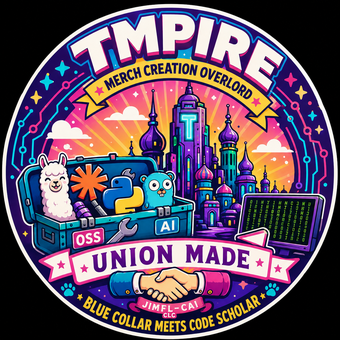

<p align="center">
  
</p>

<h1 align="center">👕 TeeEmpire</h1>

<p align="center"><em>Merch Creation Overlord · Union Made · Blue Collar Meets Code Scholar</em></p>

> A pluggable, brand-scoped automation pipeline that turns a **dropped image or text idea** into a full **print-on-demand merch bundle** (tee, tie-dye tee, mug, sticker, poster), reviews it through a local web gate, ships it to **Printify → Etsy**, and cross-promotes the drop to social via **PostBridge**.

---

## ✨ What it does

- **Drop → bundle** — drop one image (and/or a prompt) into the inbox and it fans out into the full default bundle as Printify drafts, using Printify's own server-rendered mockups.
- **Upload → RENDER (local UI)** — upload a seed image plus back/under **text** with font / color / placement dropdowns; it writes to the inbox and fires one live render so the merch **and** stamped text populate together.
- **Local approval gate** — a local-only Flask UI to review, edit, re-render, approve (→ ship), or reject pending designs.
- **Back / under text stamping** — stamp literal words onto a print placement (back, underneath, sleeves, neck); back-text tees auto-reduce to a single colorway so Printify renders the back mockup and carries it to Etsy.
- **Cross-promotion** — push the approved drop's mockup to X, LinkedIn, Facebook, TikTok, and Instagram (draft by default, live behind a flag).
- **Multi-brand / multi-platform** — YAML brand configs + JSON lane seeds, backed by an idempotent SQLite event store.

---

## 🚀 Quick start

```bash
# Install deps
pip install -r requirements.txt        # flask, Pillow, PyYAML

# Copy and fill in credentials
cp .env.example .env                    # add Printify / Etsy / image-backend / PostBridge keys

# List configured brands
python3 -m empire brands

# Launch the local approval + upload gate (recommended)
python3 -m empire gate --port 3333
# → open http://127.0.0.1:3333
```

> All commands also work as `python3 -m empire.cli <command>`.

---

## 🖥️ The local gate (`empire gate`)

The recommended entry point for day-to-day use. A local-only web UI (`127.0.0.1`) that provides:

- **⬆️ Upload → RENDER panel** — pick a seed image, optional title/prompt, and back/under text with **placement** (back · underneath · left/right sleeve · neck), **font**, and **color** dropdowns. Hitting *UPLOAD + RENDER* writes the image + a `*.empirespec.json` sidecar to the local inbox and fires `empire drop --live` in the background.
- **Gallery** of `pending_review` listings with Printify mockups and judge scores.
- **Approve + Ship** / **Reject** per card.
- **Edit / Enhance** — overlay text + tags, swap product type, promote a variant, or re-render with a prompt delta.

Everything is local: UI → local `inbox/` → local `empire drop --live`. No remote round-trip required.

---

## 📥 Drops (inbox → bundle)

Pair files **by stem** inside the inbox (`EMPIRE_INBOX`, default `./inbox`):

| Files dropped                          | Behavior                                              |
|----------------------------------------|------------------------------------------------------|
| `idea.png`                             | Image is the print art (prompt-less)                 |
| `idea.txt`                             | Prompt only — art generated from text                |
| `idea.png` + `idea.txt`                | Image is the art; text seeds title/description (and edits the art if an edit backend is set) |
| `idea.png` + `idea.empirespec.json`    | Sidecar from the upload UI: seeds the prompt **and** stamps back/under text in the same render |

```bash
# Process everything waiting in the inbox (dry-run unless --live)
python3 -m empire drop --brand earl_biggers --live

# Watch the inbox and auto-process new drops (blocking loop)
python3 -m empire watch --brand earl_biggers --live
```

- **Image extensions:** `.png .jpg .jpeg .webp`  •  **Prompt extensions:** `.txt .md .prompt`
- Processed source files move to `inbox/processed/<timestamp>/`.
- Circular logo trim is auto-applied for keyword drops (`logo`, `local81`, …) or forced with `EMPIRE_CIRCULAR_DROP=1`.

### The default bundle

| Product   | Blueprint              | Notes                                                            |
|-----------|------------------------|-----------------------------------------------------------------|
| Tee       | Bella+Canvas 3001 (12) | 7 colors; back text reduces to a single colorway for the render |
| Tie-Dye   | Gildan Tie-Dye (1950)  | Separate blueprint (3001 has no tie-dye variant)                |
| 15oz Mug  | 425                    | Logo shrunk into the top ~90% so the bottom ~10% stays clear for text |
| Sticker   | 4" (400)               | Single print area                                               |
| Poster    | 97                     | Single print area                                               |

---

## 📣 Cross-promotion (PostBridge)

Approved drops self-distribute to social — the merch lane owns its own posting.

```bash
# Manually promote a mockup (DRAFT by default; --live to publish)
python3 -m empire promote --image path/to/mockup.png --caption "New drop" --live

# Auto-promote on approve→publish during a Mission Control poll
python3 -m empire mc-poll --promote                 # draft posts
python3 -m empire mc-poll --promote --promote-live   # publish for real
```

- Targets all image-capable connected accounts by default (X, LinkedIn, Facebook, TikTok, Instagram). YouTube is excluded for still images.
- Live posting is always gated behind `--live` / `--promote-live`.
- Configure with `POST_BRIDGE_API_KEY` in `.env`.

---

## 🧱 Full pipeline (concept-first lanes)

For brand-driven generation (as opposed to ad-hoc drops):

```bash
python3 -m empire plan   --brand earl_biggers --per-lane 3   # generate Concepts
python3 -m empire design --brand earl_biggers                # build mockups
python3 -m empire list   --brand earl_biggers --platform both --live   # create drafts
python3 -m empire run    --brand nickle_ts --per-lane 2 --skip-reviews # end-to-end
python3 -m empire status                                     # DB stats
python3 -m empire analytics                                  # revenue / funnel / top sellers
```

---

## 🔌 Dry-run vs live

Every external integration (Printify, Etsy, image backends, PostBridge, Telegram) accepts a `dry_run` flag, and the CLI **defaults to dry-run** — writes are simulated and the store gets synthetic IDs. Pass **`--live`** to actually hit external APIs (after filling in `.env`).

---

## 🎨 Image backends

`EMPIRE_IMAGE_BACKEND` selects the generator; if blank, it auto-selects in this order:

| Backend       | Requires                              | Notes                                              |
|---------------|---------------------------------------|----------------------------------------------------|
| `kieai`       | `KIEAI_API_KEY` (`flux-kontext-pro`)  | **Preferred default** for generation + edits       |
| `openrouter`  | `OPENROUTER_API_KEY`                  | FLUX / SD3 variants; `EMPIRE_OPENROUTER_VARIANTS`  |
| `openai`      | `OPENAI_API_KEY`                      | `gpt-image-1`; also enables instruction-based edits |
| `comfyui`     | `COMFYUI_URL(S)` + workflow template  | Submits the workflow JSON                          |
| `placeholder` | nothing (Pillow optional)             | Title centered on the shirt color — fine for review |

When a drop pairs an image **and** a prompt, the prompt **edits** the image (img2img) if an edit backend is configured; otherwise the image is used as-is.

---

## 📂 Layout

```
.
├── brands/
│   ├── earl_biggers/   brand.yaml + lanes/*.json seed lists
│   └── nickle_ts/      brand.yaml + lanes/*.json
├── core/
│   ├── models.py          dataclasses (Brand, Concept, Design, Listing, Sale)
│   ├── store.py           SQLite (data/empire.db) — idempotent upserts
│   ├── brands.py          brand + lane loader (YAML)
│   ├── concepts.py        XAI/Grok or template concept generator
│   ├── images.py          pluggable image backends (kieai/openrouter/openai/comfyui/placeholder)
│   ├── designs.py         Pillow text rendering, fonts, circular trim, mockup compositing
│   ├── bundle.py          the default merch bundle (blueprints, variants, transforms)
│   ├── ingest.py          inbox → bundle fan-out, text stamping, mockup polling
│   ├── printify.py        Printify v1 client
│   ├── etsy.py            Etsy Open API v3 client (OAuth + listings)
│   ├── postbridge.py      PostBridge social cross-promotion client
│   ├── local_approval.py  local Flask approval + upload/RENDER gate
│   ├── mission_control.py .206 picks sync + decision apply (SSH/rsync)
│   ├── hitl.py            multi-brand Telegram review bot
│   ├── orchestrator.py    end-to-end pipeline runner
│   └── fixtures.py        legacy earl-biggers importer
├── empire/                `python -m empire <command>` shim (auto-loads .env)
├── cli.py                 command dispatch
├── cron/crontab.template
├── inbox/                 drop folder (gitignored)
├── data/                  empire.db + art/ + mockups/ (gitignored)
├── tests/
├── requirements.txt
├── .env.example
└── README.md
```

---

## ➕ Adding a brand

1. Create `brands/<slug>/brand.yaml` (voice, palette, lanes, shop IDs).
2. Add `brands/<slug>/lanes/<lane>.json` seed lists — `{"lane": ..., "seeds": [...]}`.
3. `python3 -m empire plan --brand <slug>` and onward.

Voice tuning lives in `core/concepts.py::_voiced_*` — extend the per-brand branches with your house style.

---

## 🔑 Etsy auth

```python
from core.etsy import EtsyClient
info = EtsyClient.build_authorize_url(client_id="...", redirect_uri="...")
print(info["url"])                       # open in browser
tokens = EtsyClient.exchange_code(
    client_id="...", redirect_uri="...",
    code="<from-callback>", code_verifier=info["code_verifier"])
# tokens["access_token"]  -> ETSY_OAUTH_TOKEN
# tokens["refresh_token"] -> refresh via EtsyClient.refresh()
```

---

## ✅ Tests

```bash
python3 -m unittest discover -s tests
```

All tests run dry-run — no network or credentials required.
